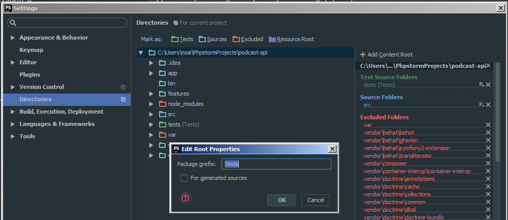
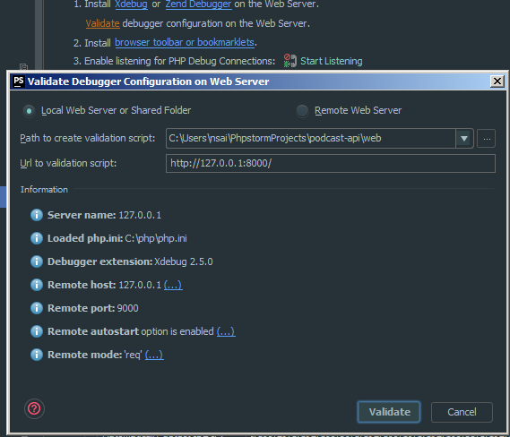
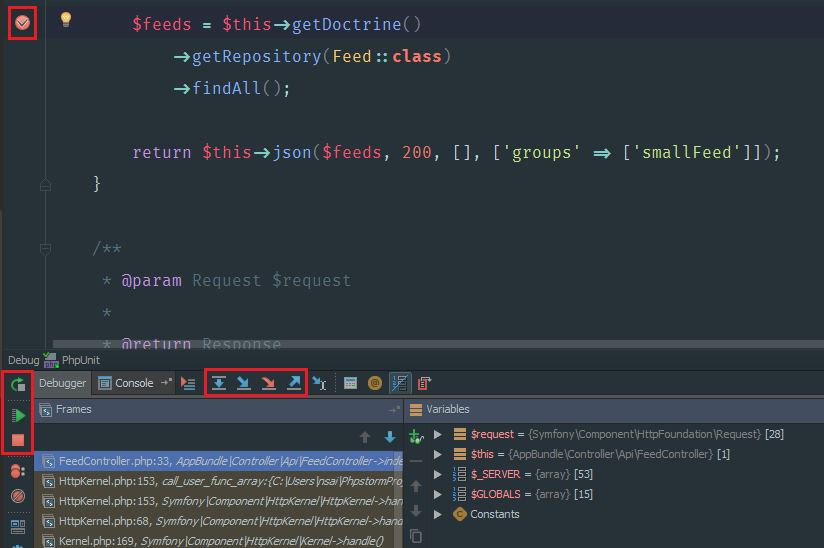
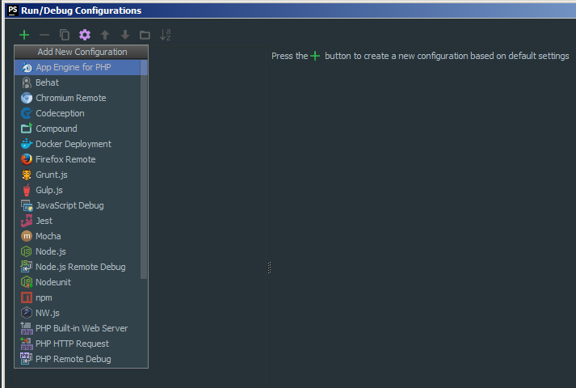
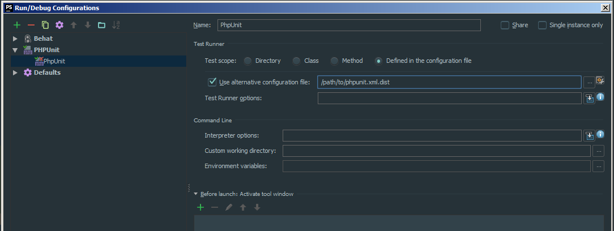
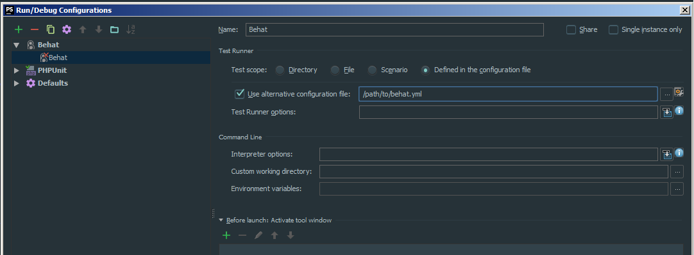
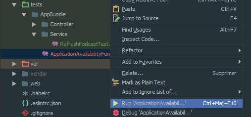
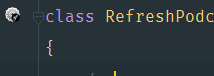
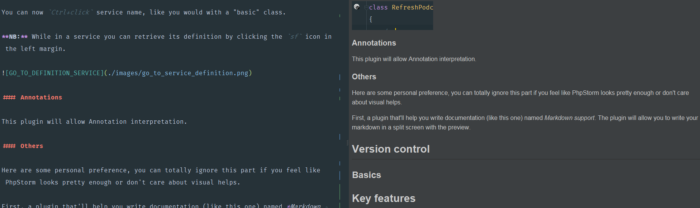
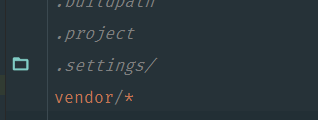

# Workflow with PhpStorm

The aim of this repo is to help you improve your workflow with JetBrains' PhpStorm. 
Phpstorm is a pretty amazing piece of software, knowing how to use some of its features can help you stay focused on your job (i.e. THE CODE).

PhpStorm is an IDE , meaning that it's much more than a simple text editor, to some extends, it can "understand" your code. Moreover, PhpStorm is shipped with many tools that will ease your workflow - you won't need X to access your DB, Y to manage VCS, Z to communicate with some remote server, it's all in PhpStorm.
   
As every extendable software, if you feel like there's something missing to really achieve the perfect workflow, there's probably a plugin to do the work for you.

P.S.
- This guide exists to help you get quickly started with PhpStorm, and is in no case a replacement for the [**official documentation**][1] (which is great !)
- This guide is open and free, feel free to contribure
- I'm not paid, nor profit in any way, by JetBrains to write this ;)

## Configuration

P.S. This chapter will unfortunately not cover configuration on Mac OS, as I ~~hate~~ don't have access to this OS. Deal with it.

The configuration is split between global and per project items. Let's start with the global configuration.

### Keymap

@todo

### Php

#### Remote or Local

Assuming php is installed locally or on some remote server, let's configure PhpStorm. In the `Settings` window :
- In `Language & Frameworks > PHP`
- If the CLI interpreter is empty, click on the `...` button
- Click the green `+` button in the top left corner of the window
- Choose the php binary you want to use (local, remote, or Docker, Vagrant, VM)

Once chosen, you can pick a *language level*, this way you can tell PhpStorm to inspect you code observing 5.6 version rules while your actual interpreter version is 7.1 (or the other way around).

#### Composer

Once you've configured a php interpreter, you can setup Composer by going to `Language & Frameworks > PHP > Composer` in the `Settings` window. You simply need to indicate the interpreter you want to use, the path to the `composer.phar` (a simple click on the link below the field will automatically download it for you) and the path to the project's `composer.json`.

#### Autoloading, namespaces and directories

Configuring the directories can greatly increase indexing performance.

If you project follows PSR-0/4, PhpStorm will prompt you with the following:

:IMAGE_PSR_PROMPT:

You can go a little further by going to `Directories` in the `Settings` window, and selecting in which directories live your project sources, test and which directories you want to ignore.

In the case of a Symfony 3 you would set the `src/` directory as Sources, the `tests/` directory as Tests and the `var/` directory as Excluded. Finally by clicking the little `P̬` button next to the `Test Source Folders` you can set the specific namespace for the `tests/` directory: 'Tests'

Correctly configuring namespaces, makes creating new classes faster, indeed PhpStorm will automatically know the namespace of your future classes.

#### XDebug

1) XDebug configuration obviously requires you to have it installed:

    ... on Debian / Ubuntu dists
    
    $: apt-get install php-xdebug
    
2) Then you need to configure the module itself:

    ... in /path/to/xdebug.ini
    
    zend_extension=/absolute/path/to/xdebug.so
	xdebug.remote_autostart = Off
	xdebug.remote_enable = On
	xdebug.remote_handler =  dbgp
	xdebug.remote_host  =  127.0.0.1
	xdebug.remote_log  = /tmp/xdebug.log
	xdebug.remote_port = 9000
	xdebug.idekey = PHPSTORM

Note that zend_extension need the absolute path to xdebug.so file, this configuration is merely a sample - feel free to tweak to your needs.

3) Setup PhpStorm:
 
Once Xdebug installed, you need to start a web server (Apache, nginx, or even php -S, ...).
In the `Settings` window, go to `Language & Frameworks > PHP > Debug`, click the `Validate` link.
Fill in the "Path to create validation script" with the path the public folder of your application (`/web` in the case of classic Symfony app).
Fill in the "Url to validation script" with the url to your application (don't forget the port if you're using `php -S`).

Click validate, ~~pray~~ everything *should* be go to go.

4) Last steps

If you manage to correctly setup XDebug, you are 3 steps away from debugging !

- Install a browser extension to enable debugging on the client side, just search for "Xdebug extension" there are plenty of them. Don't forget to tell it to use the same configuration you set as `xdebug.idekey` as IDEKEY.
- Click the `Start Listening` button in PhpStorm
- Setup some breakpoints in your code, by simply clicking in the left margin.

The first time you run the debugger, you will be prompted to accept or reject incomming connection from the debugger, click `Accept` to process.

If you've successfully followed the step, you should see the debug console popup in your IDE !

5) Debugging

While debugging, you can execute a script line after line - you can also evaluate the state of variables at any given time.

In the above screenshot you can see the current breakpoint in the script and the debugging console. On the left hand side are buttons handling the execution of the debugger (*Rerun*, *Resume* and *Stop*), on top of the console are the buttons the step by step execution of the script (*Next step*, *Step into*, *Force step into*, *Step out*).
 

### Tests

Once you've configured php and composer, PhpStorm will try to update your tests configurations (if declared as dependencies in your `composer.json` file).

To run your tests in the PhpStorm, you now need to tell it how to run your tests.

Click the `Run > Edit configurations ...` menu, or in the toolbar click the `̬  > Edit configurations ...`  button

#### PhpUnit

To add a PhpUnit test suite, click the `+` button and select `PHPUnit` or `PHPUnit by HTTP` if you want to run your test from a remote server.

#### Behat

To add a PhpUnit test suite, click the `+` button and select `Behat`.

#### Running and Debugging tests

Once your done with your run configurations, you can fire your test suites either with the play button in the Toolbar, or by going to the `Run > Run` menu.

If you want to debug a test suite you just need to click the bug button (next to the play) or by going to the `Run > Debug` menu.

**NB:** You can run/debug single test method or a single test file by right clicking on it a selecting  `Run item` where *item* is your method or file

### Plugins

When you want to install plugins not distributed by JetBrains' team you need to go to `Settings > Plugins` and click the `Browse repositories ...` button  

#### Symfony
 
This plugin will help PhpStorm "understand" your project, by reading your configurations (routes, services, security, and parameters), and even add some sweet autocomplete (in services/doctrine configuration, etc...).

Once installed and enabled, you're good to go.

You can now `Ctrl+click` service name, like you would with a "basic" class.

**NB:** While in a service you can retrieve its definition by clicking the `sf` icon in the left margin.

#### Annotations

This plugin will allow Annotation interpretation.

#### Others

Here are some personal preference, you can totally ignore this part if you feel like PhpStorm looks pretty enough or don't care about visual helps.

First, a plugin that'll help you write documentation (like this one) named *Markdown support*. The plugin will allow you to write your markdown in a split screen with the preview.

Second, a plugin that will help writing and handling `.gitignore` files simply name *.ignore*

The plugin will highlight unused entries, or directories in you `.gitignore` files

Finally, one of my favorite plugin is called *Material Theme UI*. It simply is a theme for the entire IDE that comes with new set of icons, colors and is inspired by the [*sublime text's material theme*][2]. By the way every screenshot you see in this doc are made with this theme.

## Version control

### Basics

## Key features

## Vision

In this chapter, I'll explain you my vision of what a good IDE should provide. So this chapter is highly opiniated, you may disagree - IT'S OKAY.

TL;DR: 
- Keep your workflow as clean as possible, remove anything you dont use on a day to day basis,
- Switching between windows is SLOW, I want to have as many tools integrated in my IDE as possible,
- Using the mouse is too much of hassle to be bothered with; keybind everything

### Less windows

### Less Mouse

[1]: https://www.jetbrains.com/phpstorm/documentation/
[2]: https://github.com/equinusocio/material-theme