# Workflow with PhpStorm

The aim of this repo is to help you improve your workflow with JetBrains' PhpStorm. 
Phpstorm is a pretty amazing piece of software, knowing how to use some of its features can help you stay focused on your job (i.e. THE CODE).

PhpStorm is an IDE , meaning that it's much more than a simple text editor, to some extends, it can "understand" your code. Moreover, PhpStorm is shipped with many tools that will ease your workflow - you won't need X to access your DB, Y to manage VCS, Z to communicate with some remote server, it's all in PhpStorm.
   
As every extendable software, if you feel like there's something missing to really achieve the perfect workflow, there's probably a plugin to do the work for you.

P.S.
- This guide exists to help you get quickly started with PhpStorm, and is in no case a replacement for the [**official documentation**][1] (which is great !)
- This guide is open and free, feel free to contribure
- I'm not paid, nor profit in any way, by JetBrains to write this ;)

## Configuration

P.S. This chapter will unfortunately not cover configuration on Mac OS, as I don't have access to this OS. Deal with it.


The configuration is split between global and per project items. `File > Default settings` being the global configuration and `File > Settings` the project scoped one.

### Keymap

PhpStorm comes with a lot of default keybinds depending on your OS and the default map you've selected on the first launch. This chapter is obviously not going to detail each and every action possible, instead I'd rather like to show you which are, in my opinion, some of the more interesting action you need to bind.

Let's begin with 3 actions that will save you the most time:
- Navigate > Class...
- Navigate > File...
- File structure

The first two will open a search bar where you can *fuzzy* search for a class / file. Say you want to edit the `FeedController` class or file, instead of descending the project tree node after node, you would rather hit your keybind and type in `feedc + Enter`  

File structure will open a filterable tree displaying the structure of the file. Here on can obviously click the hierarchy element you want to edit, but you can also start typing its name and hit `Enter`.

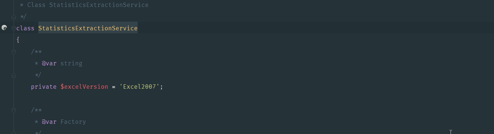

### Php

#### Remote or Local

Assuming php is installed locally or on some remote server, let's configure PhpStorm. In the `Settings` window :
- In `Language & Frameworks > PHP`
- If the CLI interpreter is empty, click on the `...` button
- Click the green `+` button in the top left corner of the window
- Choose the php binary you want to use (local, remote, or Docker, Vagrant, VM)

Once chosen, you can pick a *language level*, this way you can tell PhpStorm to inspect you code observing 5.6 version rules while your actual interpreter version is 7.1 (or the other way around).

#### Composer

Once you've configured a php interpreter, you can setup Composer by going to `Language & Frameworks > PHP > Composer` in the `Settings` window. You simply need to indicate the interpreter you want to use, the path to the `composer.phar` (a simple click on the link below the field will automatically download it for you) and the path to the project's `composer.json`.

#### Autoloading, namespaces and directories

Configuring the directories can greatly increase indexing performance.

If you project follows PSR-0/4, PhpStorm will prompt you with the following:

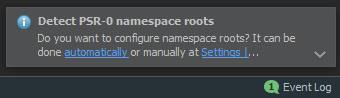

You can go a little further by going to `Directories` in the `Settings` window, and selecting in which directories live your project sources, test and which directories you want to ignore.

In the case of a Symfony 3 you would set the `src/` directory as Sources, the `tests/` directory as Tests and the `var/` directory as Excluded. Finally by clicking the little `P̬` button next to the `Test Source Folders` you can set the specific namespace for the `tests/` directory: 'Tests'


Correctly configuring namespaces, makes creating new classes faster, indeed PhpStorm will automatically know the namespace of your future classes.

#### XDebug

1) XDebug configuration obviously requires you to have it installed:

    ... on Debian / Ubuntu dists
    
    $: apt-get install php-xdebug
    
2) Then you need to configure the module itself:

    ... in /path/to/xdebug.ini
    
    zend_extension=/absolute/path/to/xdebug.so  
	xdebug.remote_autostart = Off  
	xdebug.remote_enable = On  
	xdebug.remote_handler =  dbgp  
	xdebug.remote_host  =  127.0.0.1  
	xdebug.remote_log  = /tmp/xdebug.log  
	xdebug.remote_port = 9000  
	xdebug.idekey = PHPSTORM  

Note that zend_extension need the absolute path to xdebug.so file, this configuration is merely a sample - feel free to tweak to your needs.

3) Setup PhpStorm:
 
Once Xdebug installed, you need to start a web server (Apache, nginx, or even php -S, ...).
In the `Settings` window, go to `Language & Frameworks > PHP > Debug`, click the `Validate` link.
Fill in the "Path to create validation script" with the path the public folder of your application (`/web` in the case of classic Symfony app).
Fill in the "Url to validation script" with the url to your application (don't forget the port if you're using `php -S`).

Click validate, ~~pray~~ everything *should* be go to go.


4) Last steps

If you manage to correctly setup XDebug, you are 3 steps away from debugging !

- Install a browser extension to enable debugging on the client side, just search for "Xdebug extension" there are plenty of them. Don't forget to tell it to use the same configuration you set as `xdebug.idekey` as IDEKEY.
- Click the `Start Listening` button in PhpStorm
- Setup some breakpoints in your code, by simply clicking in the left margin.

The first time you run the debugger, you will be prompted to accept or reject incomming connection from the debugger, click `Accept` to process.

If you've successfully followed the step, you should see the debug console popup in your IDE !


5) Debugging

While debugging, you can execute a script line after line - you can also evaluate the state of variables at any given time.

In the above screenshot you can see the current breakpoint in the script and the debugging console. On the left hand side are buttons handling the execution of the debugger (*Rerun*, *Resume* and *Stop*), on top of the console are the buttons the step by step execution of the script (*Next step*, *Step into*, *Force step into*, *Step out*).
 

### Tests

Once you've configured php and composer, PhpStorm will try to update your tests configurations (if declared as dependencies in your `composer.json` file).

To run your tests in the PhpStorm, you now need to tell it how to run your tests.

Click the `Run > Edit configurations ...` menu, or in the toolbar click the `̬  > Edit configurations ...`  button


#### PhpUnit

To add a PhpUnit test suite, click the `+` button and select `PHPUnit` or `PHPUnit by HTTP` if you want to run your test from a remote server.


#### Behat

To add a PhpUnit test suite, click the `+` button and select `Behat`.


#### Running and Debugging tests

Once your done with your run configurations, you can fire your test suites either with the play button in the Toolbar, or by going to the `Run > Run` menu.

If you want to debug a test suite you just need to click the bug button (next to the play) or by going to the `Run > Debug` menu.

**NB:** You can run/debug single test method or a single test file by right clicking on it a selecting  `Run item` where *item* is your method or file


### Plugins

When you want to install plugins not distributed by JetBrains' team you need to go to `Settings > Plugins` and click the `Browse repositories ...` button  

#### Symfony
 
This plugin will help PhpStorm "understand" your project, by reading your configurations (routes, services, security, and parameters), and even add some sweet autocomplete (in services/doctrine configuration, etc...).

Once installed and enabled, you're good to go.

You can now `Ctrl+click` service/route/repository names, like you would with a "basic" class. Moreover, this plugin adds a lot to the build in features of the IDE like the service generator or symfony specific inspections. 

**NB:** While in a service you can retrieve its definition by clicking the `sf` icon in the left margin.


#### Annotations

This plugin will allow Annotation interpretation.

#### Others

Here are some personal preference, you can totally ignore this part if you feel like PhpStorm looks pretty enough or don't care about visual helps.

First, a plugin that'll help you write documentation (like this one) named *Markdown support*. The plugin will allow you to write your markdown in a split screen with the preview.


Second, a plugin that will help writing and handling `.gitignore` files simply name *.ignore*


The plugin will highlight unused entries, or directories in you `.gitignore` files

Finally, one of my favorite plugin is called *Material Theme UI*. It simply is a theme for the entire IDE that comes with new set of icons, colors and is inspired by the [*sublime text's material theme*][2]. By the way every screenshot you see in this doc are made with this theme.

## Version control (Git)

Even though PhpStorm can handle project managed with Subversion, Mercurial, CVS or Perforce this chapter will only focus on the integration of Git (and GitHub to some extend).

### Basics

#### Cloning a repo

To clone a repo you can either use the `VCS > Git > Clone` menu or, if you haven't any opened project just click `Checkout from Version Control`.

If you're cloning a project from GitHub, PhpStorm will ask you for you credentials to generate an API token.

#### Handling changes

Say you've cloned the project you need to work on and begin making some changes. You can retrieve every changes you made in the *Version Control* panel in the `Local Changes` top tab.

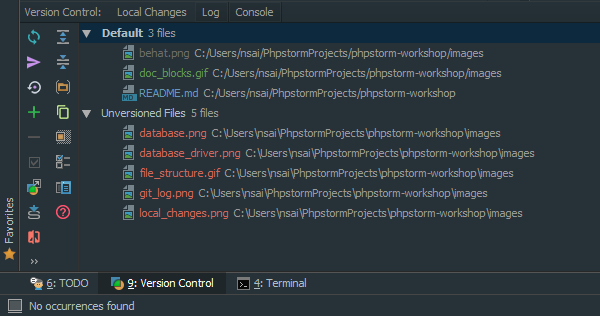

In the above illustration we can see that filenames are colored according their stage status:
- in grey: deleted files
- in green: new files
- in blue: modified files
- in red: unversionned files 

While editing a file you can also quickly view changes in the margin

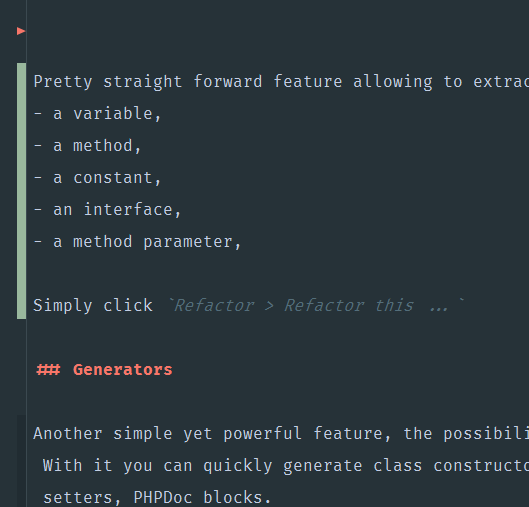

- The red `>` indicates deleted line(s)
- The beige margin indicates edited line(s)
- The dark grey margin indicates new line(s)

Clicking theses markers makes reverting changes easy: 

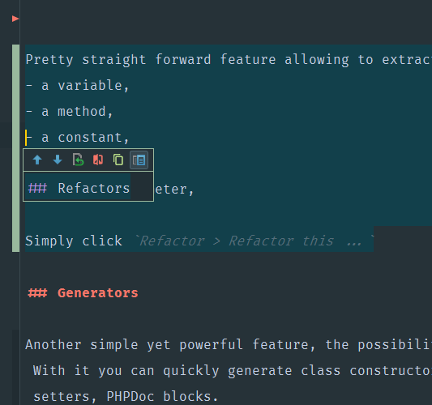

#### Committing

Once your happy with your changes, you're ready to commit them, simply go to the `Version Control` panel select the group of files you want to commit, and click the commit button on the left hand side.

You will be prompt with a window summarizing the changes, and asking you for a commit message.

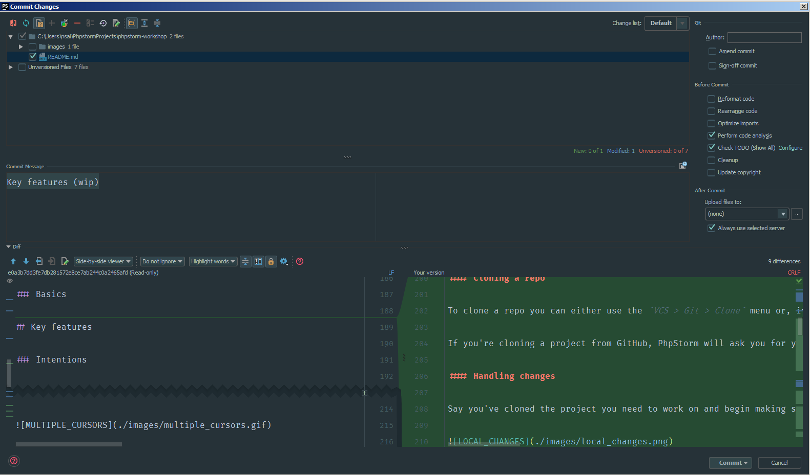

You can easily check the files concerned by the commit, and the changes in the file.

#### Pushing

Now you want to share your changes with your team, to push changes simply click `VCS > Git > Push ...`

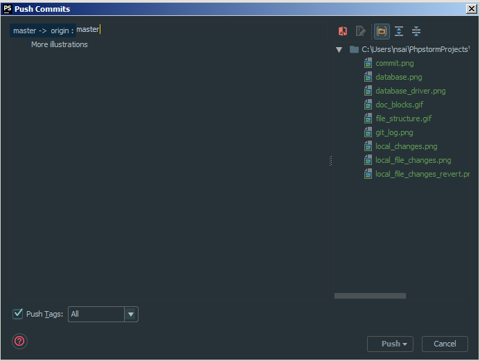

You can chose the distant branch you want to push to, and again we have a summary of the commit(s) we're about to push, and the files concerned by each commit.

### Branches

On the right hand side of the status bar you can find your current branch.


Clicking on the branch menu will allow you to create new branch, or to perform operations on both local and distant branches.


#### Updating

PhpStorm comes with a way to update your project in a key stroke, based on your need it will perform a pull on the upstream branch configured - you can event tell PhpStorm to merge or rebase. And you don't even need to worry about the current state of your workflow, if you have any pending changes, PhpStorm will automatically stash them for you while updating, then reapply the your changes.

To update click `VCS > Update project ...`
 
#### Merging and rebasing

You can easily handle creating new branches, merge branches together or rebase onto branches by using the bottom right menu.

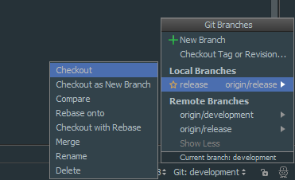

One of the best feature when it comes to Version Control in PhpStorm is its ability to handle merge conflicts.

When a merge conflict is detected, PhpStorm will prompt you with: 

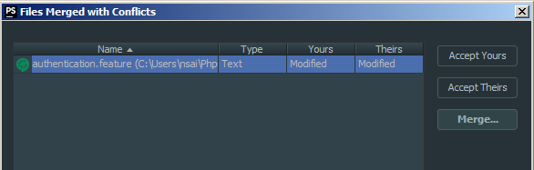

This window allows you to quickly accept one version or the other of the file, `theirs` meaning the version of the file on the branch you're on - `yours` being the version of the file on the branch you want to merge. 

If you're not sure or you want to edit the file before merging choose `Merge ...`, PhpStorm will present this intimidating windows; here you can see the two versions of the file (yours and theirs) on the sides, and in the middle you can edit

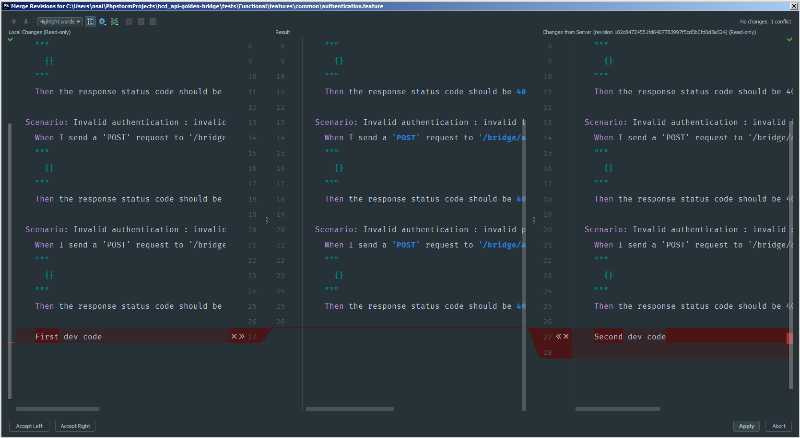


### Diffs and log

#### Diffs

PhpStorm presents diffs kind of in the way it does with merge conflicts, by show two versions of the file:  

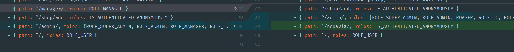

In the above example, you can that the line 
```yaml
- { path: ^/manager/, roles: ROLE_MANAGER }
```
has been deleted, the line 
```yaml
- { path: ^/hexavia/, roles: IS_AUTHENTICATED_ANONYMOUSLY }
```
has been added, and that the line
```yaml
- - { path: ^/admin/, roles: [ROLE_SUPER_ADMIN, ROLE_ADMIN, ROLE_MANAGER, R ...
```
has been modified


#### Blaming

To know how's responsible of a given line of code, you can simple right click in the left margin and select `Annotate` 

#### Log

To open and browse the log simply open the `Version Control` tool window and click on the `Log` top tab.

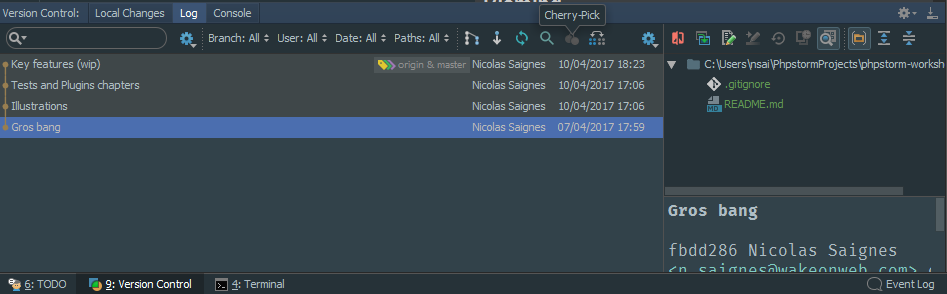

There you can search a commit, filter by branch or date and quickly see which files where affected by the commit.

You can also cherry pick commits from this panel.

## Key features

### Intentions

When PhpStorm stumbles on your code, it tries to read your intention. Say you wrote this piece of code:

```php
public function indexAction()
{
    $feeds = $this->getDoctrine()
        ->getRepository(Feed::class)
        ->findAll();
        
    ...
}
```
If you haven't imported the `Feed` class, PhpStorm will *tell* you that this class is undefined. To quickly fix this you can put your cursor on the *warned code* and hit `Alt+Enter`.

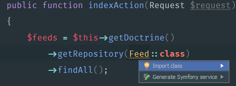

Intentions work almost everywhere, like when you want to replace double by single quotes, and can be customized. 

### Multiple cursors

If you want to edit multiple lines at the same time, you can maintain `Alt` key while selecting the lines you want to edit.

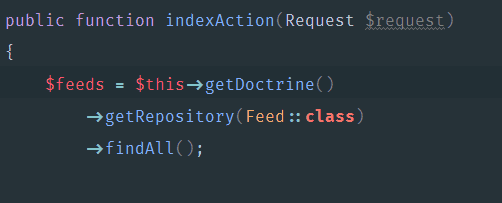


### Refactor

Pretty straight forward feature allowing to extract some code into:
- a variable,
- a method,
- a constant,
- an interface,
- a method parameter,

Simply click `Refactor > Refactor this ...`

### Generators

Another simple yet powerful feature, the possibility to generate some dummy code. With it you can quickly generate class constructors, attributes getters and setters, PHPDoc blocks.
Correctly used this feature will save you time writing repetitive code.

To use it just click `Code > Generate`

**NB:** To be even faster, when you've written a method you can generate its PHPDoc block simply by positioning the cursor above the method and hitting `/** + Enter`

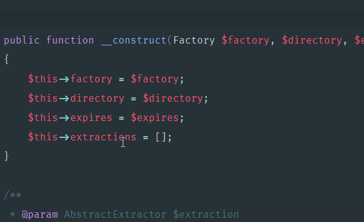

### Sync with a remote server

While working on a remote server, you probably want PhpStorm to handle file syncing with the server you're working on. To do so you need to setup a *Deployment server*, just go to `Tools > Deployment > Configuration`

There you can add a connection to a server (using FTP, SFTP, FTPS, or mounted partition), you now need to provide the mapping between your local workflow and the distant machine. Once done, if you want you can tell PhpStorm to automatically upload your changes by clicking the `Tools > Deployment > Automatic upload` option.

Finally, you may sometimes need to download a file or a folder from the remote server, simply right click (in the opened file/project tree) and select `Deployment > Download from REMOTE_SERVERNAME`

### Terminal, SSH

We'll now focus on features you can find outside of PhpStorm, that said I think that gathering as much as tools possible in the same place really helps you being productive.

Let's start with the terminal / SSH.

Nothing particular to mention here, except that you can configure the binary you want to use as terminal and its font. This parameter can be changed in `Tools > Terminal > Shell path` of the `Settings` window.

To (re)use SSH connections, go to `Tools > Start SSH session ...`.

**NB 1:** On Windows, I *strongly* encourage to use git's `bash.exe` instead of the default `cmd.exe`.

**NB 2:** If you want to share you SSH connections between your projects you need to register them as *Server* in `Tools > Deployment > Configuration`, don't forget to untick the *Visible only for this project* option

### Database

PhpStorm comes with a build-in Database manager tool, you can connect with many Database drivers such as MySQL, PostGre, SQLite or even SQL server.

To open the tool window click the bottom left button in the Status Bar 

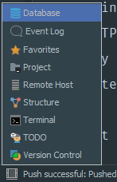

Then you can add a connection by clicking the `+` button and selecting the data source you want to add, don't forget to download the driver if you need to (a single click should be enough). You can easily setup a connection through a via SSL or SSH tunnel by going to the dedicated tab if you need to.

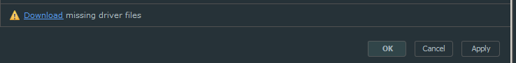

Once connected you can perform basic Database management operations, such as viewing data, modifying schemas, or updating data. You can also run queries directly in the *Console*.

*I rarely use this feature, I you feel like I've missed something don't hesite to send PR*

### Test REST API

Once again, nothing spectacular here, just a tool to make HTTP request - like the Postman browser extension. I really think it's nice to have this kind of tool integrated in the IDE.

To use it click `Tools > Test RESTful Web Service`

### Much more

Just navigate the `Code` or `Refactor` menus, you'll find plenty of useful features. Among I'd like to mention `Optimize import` or `Run inspection by name`.


[1]: https://www.jetbrains.com/phpstorm/documentation/
[2]: https://github.com/equinusocio/material-theme